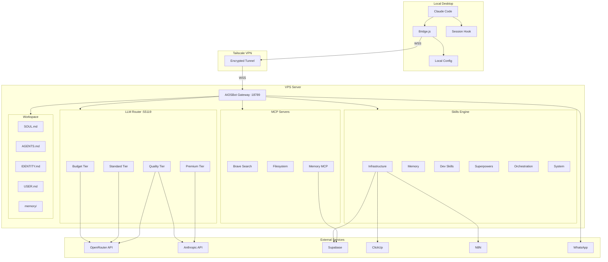

# Architecture Overview

## System Diagram

## Component Details

### Local Desktop
- **Claude Code**: Primary IDE integration
- **Bridge.js**: Service discovery, validation, and audit logging
- **Session Hook**: Auto-connects to VPS on session start
- **Config**: Gateway URL and authentication

### VPS Server
- **AIOSBot Gateway**: Central hub, handles connections, routes messages
- **LLM Router**: Intelligent model selection based on task complexity
- **Skills Engine**: 32 skills in 6 categories with progressive loading
- **MCP Servers**: External service integrations via mcporter
- **Workspace**: Agent personality, memory, and configuration

### Data Flow
1. User sends message via Claude Code or WhatsApp
2. Message reaches gateway via Tailscale or direct connection
3. Gateway classifies the request (skill hint + keywords)
4. LLM Router selects optimal model for the tier
5. Skills execute tool calls if needed
6. Response flows back through the same path

### Security Layers
1. **Transport**: Tailscale encrypted VPN
2. **Authentication**: Password-based gateway auth
3. **Authorization**: WhatsApp allowlist, DM policy
4. **Secrets**: .env file, permission 600 on configs
5. **Isolation**: Sandbox mode configurable in aiosbot.json (default: off)
6. **Workspace Restriction**: `restrictToWorkspace: true` limits filesystem access to workspace + allowed paths only
7. **Shell Hardening**: `denyPatterns` blocks destructive commands (rm -rf /, fork bombs, pipe-to-shell, etc.)
