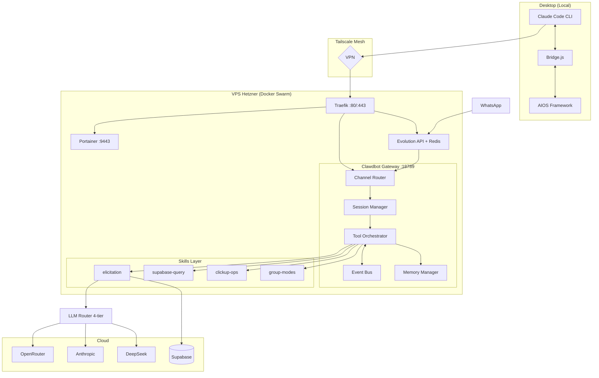
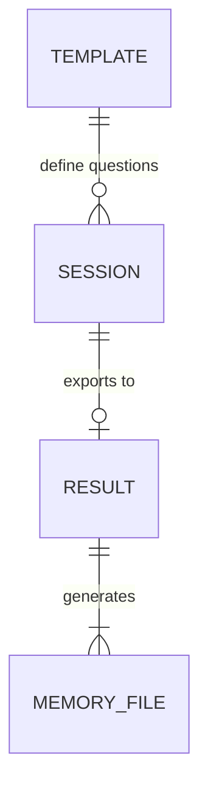
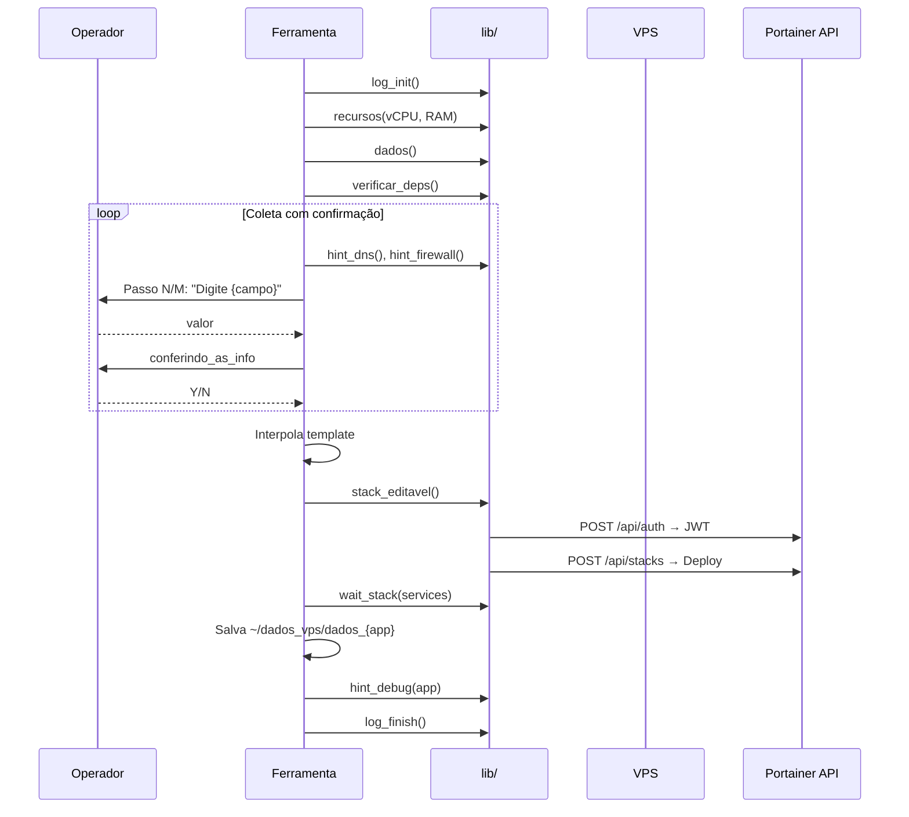
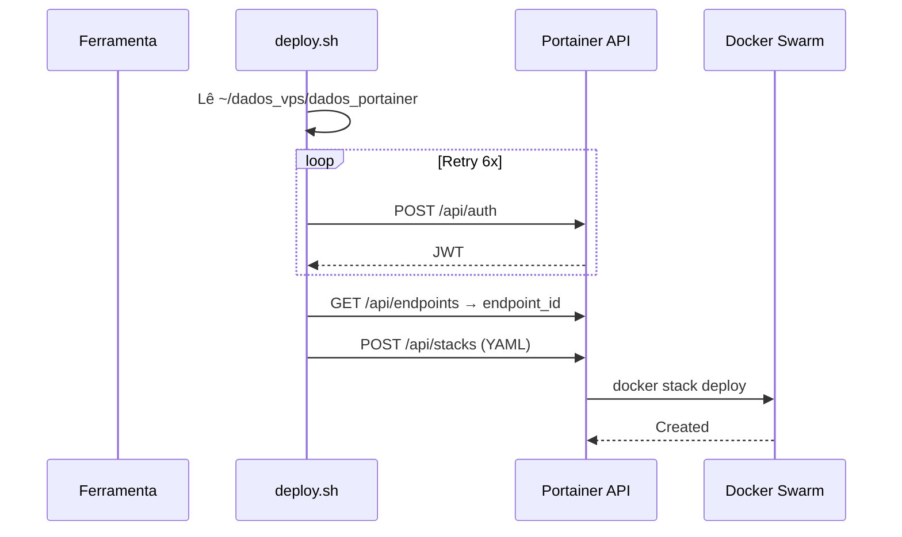

# Legendsclaw Fullstack Architecture Document

> **Versão:** 1.0 | **Data:** 2026-02-20 | **Autor:** @architect (Aria)
> **Input:** `docs/prd.md` (20 FRs, 9 NFRs, 5 Epics, 15 Stories)
> **Referências:** `docs/objetivo/guide.md`, `docs/referencia/orion-script-racional.md`

---

## Change Log

| Date | Version | Description | Author |
|------|---------|-------------|--------|
| 2026-02-20 | 1.0 | Initial fullstack architecture | @architect (Aria) |

---

## 1. Introduction

### Starter Template / Projeto Base

Este é um projeto greenfield com AIOS-Core já bootstrapped. A base de referência são:
- **OpenClaw** (repositório do Pedro) — Gateway AI com LLM Router, já funcional
- **SetupOrion v2.8.0** — 44k linhas bash, patterns de deploy automatizado
- **apps/clawdbot/** — Instância de referência (a ser copiada e customizada)

O projeto NÃO usa starter web tradicional. É composto por:
1. **Deployer** — Script bash modular inspirado no SetupOrion
2. **Instância Whitelabel** — Config + Skills Node.js rodando no OpenClaw
3. **Skill Elicitation** — Node.js + Supabase, integrada ao LLM Router

---

## 2. High Level Architecture

### Technical Summary

Legendsclaw é um sistema de deploy automatizado + agente AI whitelabel composto por 3 camadas: (1) um deployer bash modular que provisiona VPS Hetzner com Docker Swarm, instala a stack completa, e guia o operador com hints inteligentes — inspirado nos patterns do SetupOrion; (2) uma instância OpenClaw Gateway rodando como serviço systemd, com Channel Router multi-canal (WhatsApp via Evolution API), Session Manager por usuário, Tool Orchestrator, e LLM Router 4-tier para otimização de custo; (3) uma skill layer com a `elicitation` como peça central, que conduz entrevistas estruturadas via WhatsApp com session state persistido no Supabase. A comunicação desktop↔VPS é segura via Tailscale mesh, e a integração com Claude Code é feita via Bridge.js (auto-discovery) e hooks.

### Platform and Infrastructure

**Platform:** Hetzner Cloud (VPS) + Docker Swarm + Supabase (cloud)

**Key Services:**
- Hetzner CX21+ — VPS compute (2 vCPU, 4GB RAM, ~€5/mês)
- Docker Swarm — Orquestração single-node
- Traefik v3.5.3 — Reverse proxy + HTTPS automático (Let's Encrypt)
- Portainer CE — Gerenciamento visual + API de deploy
- Tailscale — VPN mesh (WireGuard)
- Supabase — Database cloud (elicitation templates/sessions/results)
- OpenRouter — LLM routing multi-provider

**Deployment Regions:** Hetzner Helsinki (ou mais próximo do público-alvo)

### Repository Structure

**Structure:** Monorepo (já existente como `legendsclaw/`)
**Monorepo Tool:** N/A — projeto simples, npm workspaces não necessário

### Architecture Diagram



### Architectural Patterns

- **Deployer as Infrastructure-as-Script:** Script bash modular, ciclo de 8 etapas por ferramenta. — _Rationale:_ Pattern comprovado pelo SetupOrion (80+ apps)
- **Channel Router + Session Manager:** Gateway multi-canal com sessão por phone/user. — _Rationale:_ Desacopla canais da lógica de negócio
- **Tool Orchestrator + Skills:** Módulos independentes com interface padronizada. — _Rationale:_ Extensibilidade sem mudar o gateway
- **LLM Router 4-Tier:** Routing por custo/complexidade. — _Rationale:_ Reduziu custo de US$228/dia para fração
- **State-as-Filesystem:** Credenciais em plaintext, YAMLs no disco. — _Rationale:_ grep+awk sem dependências
- **Deploy via Portainer API:** REST API com JWT auth. — _Rationale:_ Edição visual pós-deploy
- **Elicitation as Stateful Skill:** Session state no Supabase, LLM extraction com confidence score. — _Rationale:_ Conversas assíncronas via WhatsApp

---

## 3. Tech Stack

| Category | Technology | Version | Purpose | Rationale |
|----------|------------|---------|---------|-----------|
| Script Language | Bash | 5.x | Deployer interativo | Pattern Orion, zero deps |
| JSON Parsing | jq | 1.6+ | Parse Portainer API | SetupOrion pattern |
| HTTP Client | curl | latest | API calls, health checks | Universal |
| VPS | Hetzner CX21+ | Ubuntu 22.04 | Compute | ~€5/mês, API provisionamento |
| Orquestração | Docker Swarm | latest | Containers | Overlay network, Portainer |
| Reverse Proxy | Traefik | v3.5.3 | HTTPS automático | Let's Encrypt zero-config |
| Container Mgmt | Portainer CE | latest | GUI + deploy API | Edição visual pós-deploy |
| VPN | Tailscale | latest | Mesh desktop↔VPS | WireGuard, zero config |
| Runtime | Node.js | ≥ 22 | OpenClaw Gateway + Skills | Exigido pelo OpenClaw |
| Package Manager | pnpm | latest | OpenClaw | Oficial do OpenClaw |
| Process Manager | systemd | OS-native | Serviço persistente | Restart always, journalctl |
| LLM Budget | DeepSeek Chat | latest | Status, pings | ~$0.14/M tokens |
| LLM Standard | Claude 3.5 Haiku | latest | Ops gerais | ~$0.80/M tokens |
| LLM Quality | Claude Sonnet | latest | Análises, extraction | ~$3.00/M tokens |
| LLM Premium | Claude Opus | latest | Decisões complexas | ~$15.00/M tokens |
| LLM Gateway | OpenRouter | — | Multi-provider | API unificada |
| Database | Supabase (cloud) | latest | Elicitation data | Managed, RLS, REST |
| Memory | File System | — | Contexto agente | Leitura rápida |
| State (deployer) | Plaintext | — | `~/dados_vps/` | grep+awk, pattern Orion |
| Cache | Redis | latest | Sessions Evolution | Embutido nas stacks |
| WhatsApp | Evolution API | latest | Conector WhatsApp | Open source, QR pairing |
| Security L1 | blocklist.yaml | — | Command filtering | Regex, whitelist por skill |
| Security L2 | Docker Alpine | 3.19 | Sandbox isolado | network:none, read_only |
| Security L3 | journald + logrotate | OS-native | Audit trail | 6 meses retenção |

---

## 4. Data Models

### Domínio 1: Deployer State (Plaintext — ~/dados_vps/)

```
~/dados_vps/
├── dados_vps              # Nome do Servidor, Rede interna, IP
├── dados_portainer        # Dominio, Usuario, Senha, Token JWT
├── dados_tailscale        # Hostname, Tailnet ID
├── dados_openclaw         # Dominio, Porta, Status
├── dados_whitelabel       # Agent Name, Display Name, Icon, Persona
├── dados_llm_router       # Default Tier, providers configurados
├── dados_skills           # Skills ativas (lista)
├── dados_evolution        # Dominio, API Key, WhatsApp number
├── dados_seguranca        # Layer 1/2/3 status
├── dados_bridge           # Status configuração
└── relatorio_instalacao   # Relatório final completo
```

**Leitura:**
```bash
dados() {
    nome_servidor=$(grep "Nome do Servidor:" ~/dados_vps/dados_vps | awk -F': ' '{print $2}')
    nome_rede=$(grep "Rede interna:" ~/dados_vps/dados_vps | awk -F': ' '{print $2}')
}
```

### Domínio 2: Elicitation (Supabase)

```typescript
interface ElicitationTemplate {
  id: string;                    // uuid
  name: string;                  // 'onboarding-founder'
  version: number;
  sections: TemplateSection[];   // JSONB
  created_at: string;
}

interface TemplateSection {
  id: string;
  title: string;
  questions: TemplateQuestion[];
}

interface TemplateQuestion {
  id: string;
  text: string;
  type: 'text' | 'choice' | 'rating' | 'multiline';
  required: boolean;
  hints: string;
  extraction_key: string;
}

interface ElicitationSession {
  id: string;
  template_id: string;
  user_phone: string;
  user_name: string | null;
  status: 'active' | 'paused' | 'completed' | 'expired';
  current_section: number;
  current_question: number;
  responses: Record<string, {
    value: any;
    confidence: number;
    raw: string;
    extracted_at: string;
  }>;
  context: { summary: string; follow_ups: string[] };
  started_at: string;
  updated_at: string;
  completed_at: string | null;
}

interface ElicitationResult {
  id: string;
  session_id: string;
  template_name: string;
  exported_data: {
    founder: Record<string, any>;
    company: Record<string, any>;
    metadata: { duration_minutes: number; total_messages: number; completion_rate: number };
  };
  files_generated: string[];
  exported_at: string;
}
```

### Database Schema (SQL)

```sql
CREATE TABLE elicitation_templates (
    id UUID PRIMARY KEY DEFAULT gen_random_uuid(),
    name TEXT NOT NULL UNIQUE,
    version INT DEFAULT 1,
    sections JSONB NOT NULL,
    created_at TIMESTAMPTZ DEFAULT now()
);

CREATE TABLE elicitation_sessions (
    id UUID PRIMARY KEY DEFAULT gen_random_uuid(),
    template_id UUID NOT NULL REFERENCES elicitation_templates(id),
    user_phone TEXT NOT NULL,
    user_name TEXT,
    status TEXT NOT NULL DEFAULT 'active'
        CHECK (status IN ('active', 'paused', 'completed', 'expired')),
    current_section INT DEFAULT 0,
    current_question INT DEFAULT 0,
    responses JSONB DEFAULT '{}',
    context JSONB DEFAULT '{"summary": "", "follow_ups": []}',
    started_at TIMESTAMPTZ DEFAULT now(),
    updated_at TIMESTAMPTZ DEFAULT now(),
    completed_at TIMESTAMPTZ,
    CONSTRAINT unique_active_session UNIQUE (user_phone, status)
);

CREATE TABLE elicitation_results (
    id UUID PRIMARY KEY DEFAULT gen_random_uuid(),
    session_id UUID NOT NULL REFERENCES elicitation_sessions(id),
    template_name TEXT NOT NULL,
    exported_data JSONB NOT NULL,
    files_generated TEXT[] DEFAULT '{}',
    exported_at TIMESTAMPTZ DEFAULT now()
);

CREATE INDEX idx_sessions_phone ON elicitation_sessions(user_phone);
CREATE INDEX idx_sessions_status ON elicitation_sessions(status);
CREATE INDEX idx_results_session ON elicitation_results(session_id);

ALTER TABLE elicitation_templates ENABLE ROW LEVEL SECURITY;
ALTER TABLE elicitation_sessions ENABLE ROW LEVEL SECURITY;
ALTER TABLE elicitation_results ENABLE ROW LEVEL SECURITY;

CREATE POLICY "Service role full access" ON elicitation_templates FOR ALL USING (auth.role() = 'service_role');
CREATE POLICY "Service role full access" ON elicitation_sessions FOR ALL USING (auth.role() = 'service_role');
CREATE POLICY "Service role full access" ON elicitation_results FOR ALL USING (auth.role() = 'service_role');
```

### Domínio 3: Memory Manager (File System)

```
~/.clawd/memory/
├── sessions/{session-id}.json
├── elicitation/{session-id}/
│   ├── User.md
│   ├── Company.md
│   └── TechStack.md
├── facts/{date}-facts.json
└── unified/memory.json
```

### Relationships



---

## 5. Components

### Component 1: Deployer Core

**Responsibility:** Script bash modular que automatiza a instalação completa via ciclo de 8 etapas do SetupOrion.

**Structure:**
```
deployer/
├── setup.sh                     # Bootstrap (curl | bash)
├── deployer.sh                  # Entry point + menu
├── lib/
│   ├── common.sh                # dados(), recursos(), verificar_*(), validar_senha()
│   ├── deploy.sh                # stack_editavel(), wait_stack(), pull(), criar_banco()
│   ├── hints.sh                 # hint_dns(), hint_firewall(), hint_provider(), hint_debug()
│   ├── ui.sh                    # step_ok(), step_fail(), step_skip(), tabela()
│   └── logger.sh                # log_init(), log(), log_finish()
├── ferramentas/
│   ├── 01-base.sh               # Traefik + Portainer + Docker Swarm
│   ├── 02-tailscale.sh          # Tailscale mesh VPN
│   ├── 03-openclaw.sh           # OpenClaw Gateway + systemd
│   ├── 04-whitelabel.sh         # Identidade do agente
│   ├── 05-llm-router.sh         # LLM Router 4-tier + API keys
│   ├── 06-skills.sh             # Skills existentes
│   ├── 07-elicitation.sh        # Skill elicitation + Supabase
│   ├── 08-evolution.sh          # Evolution API + WhatsApp
│   ├── 09-seguranca.sh          # 3 Layers de segurança
│   ├── 10-bridge.sh             # Claude Code integration
│   └── 11-validacao.sh          # Checklist final 12 pontos
├── templates/
│   ├── traefik.yaml.tmpl
│   ├── portainer.yaml.tmpl
│   ├── openclaw.service.tmpl
│   ├── evolution.yaml.tmpl
│   └── sandbox.Dockerfile.tmpl
├── migrations/
│   └── 001-elicitation-tables.sql
└── seeds/
    └── 001-onboarding-founder.sql
```

### Component 2: Clawdbot Gateway (OpenClaw)

**Responsibility:** Gateway AI multi-canal com Session Manager, Tool Orchestrator, Event Bus.

**Interfaces:** `POST /webhook/*`, `GET /health`, `POST /agent`

### Component 3: LLM Router

**Responsibility:** Routing 4-tier (budget→standard→quality→premium) com fallback.

**Logic:** Skill → tier mapping → provider selection → retry → fallback up

### Component 4: Skill Elicitation

**Responsibility:** Entrevistas estruturadas via WhatsApp com 4 tools.

**Interfaces:**
- `start_session(template_id, phone)` → `{ session_id, first_question }`
- `process_message(session_id, msg)` → `{ next_question | completion }`
- `get_status(session_id)` → `{ progress_pct, filled, pending }`
- `export_results(session_id)` → `{ files: [User.md, Company.md, TechStack.md] }`

### Component 5: Evolution API

**Responsibility:** Ponte WhatsApp↔Gateway. QR pairing, envio/recebimento de mensagens.

### Component 6: Security Layer

**Responsibility:** 3 camadas: blocklist (app), sandbox (container), logging (sistema).

### Component 7: Bridge.js

**Responsibility:** Auto-discovery de serviços + Claude Code hooks.

---

## 6. Core Workflows

### Workflow 1: Deployer — Ciclo de Vida de Uma Ferramenta



### Workflow 2: Elicitation — Conversa Completa

```mermaid
sequenceDiagram
    participant U as WhatsApp
    participant EVO as Evolution
    participant GW as Gateway
    participant EL as Elicitation
    participant LR as LLM Router
    participant SB as Supabase

    U->>EVO: mensagem
    EVO->>GW: webhook
    GW->>EL: start_session(template, phone)
    EL->>SB: CREATE session
    EL-->>U: primeira pergunta

    loop Até completar
        U->>EVO->>GW->>EL: resposta
        EL->>LR: extract(question, answer, tier:standard)
        alt confidence >= 0.7
            EL->>SB: UPDATE responses
            EL-->>U: próxima pergunta
        else confidence < 0.7
            EL-->>U: follow-up de clarificação
        end
    end

    EL->>SB: status = completed
    EL->>EL: export_results()
    EL-->>U: "Entrevista concluída! 🎉"
```

### Workflow 3: Deploy via Portainer API



---

## 7. Unified Project Structure

```
legendsclaw/
├── .aios-core/                              # AIOS Framework (don't touch)
│   └── infrastructure/services/
│       ├── bridge.js                        # Auto-discovery core
│       └── {agent}/index.js                 # Health check
├── .claude/settings.json                    # Hooks config
├── apps/{agent}/                            # Instância whitelabel
│   ├── config/llm-router-config.yaml
│   ├── hooks/session-digest/
│   ├── lib/ (llm-router, metrics)
│   └── skills/
│       ├── index.js, config.js, package.json
│       ├── elicitation/                     # ⭐ NOVA
│       │   ├── SKILL.md, index.js
│       │   └── tools/ (start_session, process_message, get_status, export_results)
│       ├── clickup-ops/, supabase-query/, group-modes/, ...
│       └── lib/ (blocklist.yaml, command-safety.js)
├── deployer/                                # ⭐ NOVO
│   ├── setup.sh, deployer.sh
│   ├── lib/ (common, deploy, hints, ui, logger)
│   ├── ferramentas/ (01-base ... 11-validacao)
│   ├── templates/ (*.yaml.tmpl)
│   ├── migrations/ (001-elicitation-tables.sql)
│   └── seeds/ (001-onboarding-founder.sql)
├── docs/
│   ├── prd.md, architecture/, objetivo/, referencia/
│   └── stories/
├── .env.example, package.json, README.md
```

---

## 8. Development Workflow

### Prerequisites
```bash
node --version    # >= 22
pnpm --version    # latest
git --version
claude --version  # Claude Code CLI
tailscale status  # Tailscale client
```

### Development Commands
```bash
# Deployer — testar ferramentas isoladamente
bash deployer/ferramentas/01-base.sh

# Menu completo
bash deployer/deployer.sh

# Skills — instalar e testar
cd apps/{agent}/skills && npm install

# Validação completa
bash deployer/ferramentas/11-validacao.sh
```

### Environment Variables
```bash
# .env
OPENROUTER_API_KEY=sk-or-v1-xxx
ANTHROPIC_API_KEY=sk-ant-xxx
DEEPSEEK_API_KEY=sk-xxx
SUPABASE_URL=https://xxx.supabase.co
SUPABASE_ANON_KEY=eyJ...
SUPABASE_SERVICE_ROLE_KEY=eyJ...
LLM_ROUTER_ENABLED=true
LLM_ROUTER_CONFIG_PATH=apps/{agent}/config/llm-router-config.yaml
LLM_ROUTER_DEFAULT_TIER=standard
```

### Incremental Development (4 semanas)

| Semana | Foco | Entregável |
|--------|------|------------|
| 1 | Deployer Core | lib/ + 01-base.sh testado em VPS real |
| 2 | Gateway + Identity | 02-tailscale → 05-llm-router, gateway respondendo via Tailscale |
| 3 | Skills + Elicitation | 06-skills → 07-elicitation, entrevista funcional |
| 4 | WhatsApp + Validation | 08-evolution → 11-validacao, teste E2E WhatsApp |

---

## 9. Deployment Architecture

### Deploy Methods

| Serviço | Método | Persistência |
|---------|--------|-------------|
| Traefik + Portainer | `docker stack deploy` (1º deploy) | `~/traefik.yaml`, `~/portainer.yaml` |
| OpenClaw Gateway | systemd service | `/etc/systemd/system/openclaw.service` |
| Evolution API | Portainer API (`stack_editavel`) | `~/evolution.yaml` |
| Skills | `npm install` | `apps/{agent}/skills/` |
| Supabase | Cloud (managed) | Migrations SQL |

### Environments

| Environment | Gateway URL | Portainer |
|-------------|------------|-----------|
| Local (dev) | `http://localhost:18789` | N/A |
| VPS (prod) | `http://{hostname}.tailXXX.ts.net:18789` | `https://painel.dominio.com` |

---

## 10. Security and Performance

### Security (3 Layers)

```
Layer 3: Logging & Audit (journald + logrotate + PostToolUse hook)
  └── Layer 2: Docker Sandbox (Alpine, non-root, network:none, read_only, 256m)
        └── Layer 1: Command Safety (blocklist.yaml + command-safety.js + PreToolUse hook)
```

### Network Security

| Controle | Implementação |
|----------|---------------|
| VPN | Tailscale mesh (WireGuard) |
| Firewall | Hetzner: 22, 80, 443, 9443, 41641 |
| HTTPS | Traefik + Let's Encrypt |
| Auth | Portainer JWT, Evolution API Key, Supabase Service Role |

### Performance Targets

| Métrica | Target |
|---------|--------|
| Gateway response | < 2s (budget), < 5s (premium) |
| WhatsApp latency | < 3s |
| Deployer step | < 30s (exceto pull/wait) |
| Full install | ≤ 2h E2E |

---

## 11. Coding Standards

### Critical Rules

- **Source antes de usar:** Toda ferramenta `source lib/*.sh`
- **Log tudo:** `log_init` no início, `log_finish` no final
- **Nunca falhar silenciosamente:** `step_fail` com causa + sugestão
- **Hints obrigatórios:** Toda coleta de input tem hint contextual
- **Loop confirmado:** Pattern `while true; read; conferindo_as_info; Y/N; done`
- **Estado depois do deploy:** Salva `~/dados_vps/dados_{app}` após sucesso
- **Supabase via Service Role:** Nunca Anon Key para write
- **LLM tier explícito:** Toda chamada especifica tier
- **Confidence check:** < 0.7 → follow-up obrigatório

### Naming Conventions

| Element | Convention | Example |
|---------|-----------|---------|
| Ferramenta | `NN-nome.sh` | `01-base.sh` |
| Função bash | `snake_case` | `stack_editavel()` |
| Variável bash | `snake_case` | `$nome_servidor` |
| Template | `nome.yaml.tmpl` | `traefik.yaml.tmpl` |
| Dados VPS | `dados_{app}` | `dados_portainer` |
| Log | `{ferramenta}-{ts}.log` | `base-20260220-153000.log` |
| Skill dir | `kebab-case/` | `elicitation/` |
| Skill tool | `snake_case.js` | `start_session.js` |
| Supabase table | `snake_case` | `elicitation_sessions` |

### Error Handling (Deployer)

```bash
executar() {
    local descricao="$1" comando="$2" step="$3" total="$4"
    log "Executando: $descricao"
    if eval "$comando" >> "$LOG_FILE" 2>&1; then
        step_ok "$step" "$total" "$descricao"
    else
        step_fail "$step" "$total" "$descricao"
        log "FALHA: $descricao (exit code: $?)"
        return 1
    fi
}
```

### Error Handling (Skills)

```javascript
async function processMessage(sessionId, message) {
  try {
    const session = await supabase
      .from('elicitation_sessions').select('*')
      .eq('id', sessionId).single();
    if (!session.data) throw new Error(`Session ${sessionId} not found`);

    const extraction = await llmRouter.extract({
      question: getCurrentQuestion(session.data),
      answer: message,
      schema: getExtractionSchema(session.data),
    }, { tier: 'standard' });

    if (extraction.confidence < 0.7) {
      return { type: 'follow_up', question: generateFollowUp(extraction) };
    }
    await updateSessionResponse(sessionId, extraction);
    const next = getNextQuestion(session.data);
    return next ? { type: 'question', question: next } : { type: 'completed' };
  } catch (error) {
    console.error(`Error in processMessage(${sessionId}):`, error);
    throw new Error(`Failed to process message: ${error.message}`);
  }
}
```

---

## Next Steps

### Architect Prompt (para @sm)

> @sm — Use `docs/prd.md` e `docs/architecture/fullstack-architecture.md` para criar stories detalhadas em `docs/stories/`. Comece pelo Epic 1 (Base Infrastructure). Cada story deve referenciar os componentes e workflows definidos nesta arquitetura.

---

*Arquitetura gerada por @architect (Aria) — Arquitetando o futuro 🏗️*
